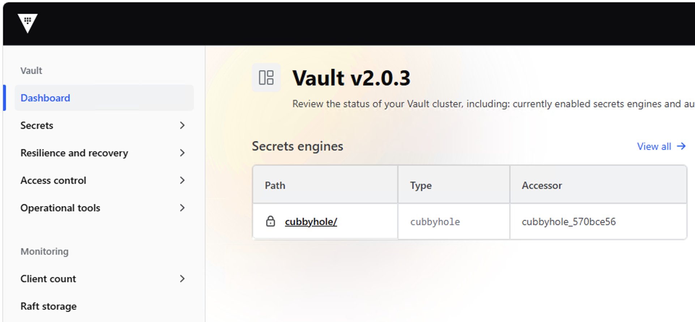

# Hasihcorp Vault on vSphere Kubernetes Service

This repository contains a proof of concept install of Hashicorp Vault on VMware vSphere Kubernetes Service (VKS).  This repository leverages helm to install Vault

This install uses self-signed certificates for the intenal RAFT communication and vault connection and is not intended as an Enterprise ready install.  While the helm-values file does adhere to secure best practices it is not intended for production install and you should follow the official Hashicorp Vault documentation. 

This documentation and all accompanying code, scripts, and manifests are provided **"AS IS" WITHOUT WARRANTY OF ANY KIND**, either expressed or implied, including but not limited to the implied warranties of merchantability, fitness for a particular purpose, or non-infringement. The entire risk as to the quality, execution, and performance of these steps is borne entirely by you. In no event shall the authors be liable for any damages, system failures, data loss, or production outages resulting from the use of this guide. Use these materials at your own discretion.

## Vault Install

### Pre-work

1. Create a VKS Cluster if needed.  The test environment is using a single control-plane (2vcpu x 8 GB) and 3 worker nodes (4vcpu x 16 GB).  Sizing should depend requirements and Vault documentation.
2. We are exposing the Vault Web UI using GatewayAPI using the VKS Contour addon.  If you prefer to use another method you can skip deploying the `01-contour-addon.yaml` to your VKS cluster.
3. Create the Vault Namespace `02-vault-namespace.yaml`
4. Create the Contour GatewayClass and Gateway (skip if not using contour and GatewayAPI) `03-gateway.yaml`
5. We are using self-signed cluster-issuer and secret for the internal vault communication because it requires SAN for all the HA components.  This is not ideal but we chose this for a lab install.  `04-vault-self-signed-issuer.yaml`
6. We are using a seperate LetsEncrypt tls certificate for the Web UI.  Again you can choose to use a single certificate for all of the components.  `05-vault-external-tls-secret.yaml`

### Helm-Values

We provided a example HA based helm-values file for this install with appropriate hardening and configuration.  You should consult the Vault documentation or your Vault team for specific configuration options.  `helm-values.yaml`

### Helm Install Command
```
helm install vault hashicorp/vault --values helm-values.yaml --namespace vault
```
## Post-Install Vault Initialization and Unsealing

### Intialize Vault-0 Pod
```
# We need to supply the certificate since we used self-signed
kubectl exec -i vault-0 -n vault -- vault operator init \
  -ca-cert=/vault/userconfig/vault-internal-tls/ca.crt \
  -format=json > vault-keys.json

# Secure the vault-keys.json  
chmod 600 vault-keys.json
```
IMPORTANT: Securely store the Unseal Keys (5 generated by default) and the Initial Root Token output by this command. If you lose these, you will lose access to Vault. 

### Unseal Vault using the vault-keys.json

**Vault-0**
```
# Can use any 3 of the 5 keys and supply the certificate

kubectl exec -i vault-0 -n vault -- vault operator unseal -ca-cert=/vault/userconfig/vault-internal-tls/ca.crt $(jq -r '.unseal_keys_b64[0]' vault-keys.json)
kubectl exec -i vault-0 -n vault -- vault operator unseal -ca-cert=/vault/userconfig/vault-internal-tls/ca.crt $(jq -r '.unseal_keys_b64[1]' vault-keys.json)
kubectl exec -i vault-0 -n vault -- vault operator unseal -ca-cert=/vault/userconfig/vault-internal-tls/ca.crt $(jq -r '.unseal_keys_b64[2]' vault-keys.json)
```
Expected Output After the 3rd Key is Applied:
```
Seal Type               shamir
Initialized             true                  <---- Initizlized True
Sealed                  false                 <---- Sealed False
Total Shares            5
Threshold               3
Version                 2.0.3
Build Date              2026-06-17T12:39:45Z
Storage Type            raft
Cluster Name            vault-raft01
Cluster ID              f11790eb-9494-b956-7acf-d73279fde946
Removed From Cluster    false
HA Enabled              true                                    <---- HA Enabled
HA Cluster              https://vault-0.vault-internal:8201     <---- HA Leader is Vault-0
HA Mode                 active
Active Since            2026-09-30T22:33:59.36880955Z
Raft Committed Index    38
Raft Applied Index      38
```
**Vault-1**
```
kubectl exec -i vault-1 -n vault -- vault operator unseal -ca-cert=/vault/userconfig/vault-internal-tls/ca.crt $(jq -r '.unseal_keys_b64[0]' vault-keys.json)
kubectl exec -i vault-1 -n vault -- vault operator unseal -ca-cert=/vault/userconfig/vault-internal-tls/ca.crt $(jq -r '.unseal_keys_b64[1]' vault-keys.json)
kubectl exec -i vault-1 -n vault -- vault operator unseal -ca-cert=/vault/userconfig/vault-internal-tls/ca.crt $(jq -r '.unseal_keys_b64[2]' vault-keys.json)
```
Expected Output After the 3rd Key is Applied:
```
Seal Type               shamir
Initialized             true                  <---- Initizlized True
Sealed                  false                 <---- Sealed False
Total Shares            5
Threshold               3
Version                 2.0.3
Build Date              2026-06-17T12:39:45Z
Storage Type            raft
Cluster Name            vault-raft01
Cluster ID              f11790eb-9494-b956-7acf-d73279fde946
Removed From Cluster    false
HA Enabled              true                                    <---- HA Enabled
HA Cluster              https://vault-0.vault-internal:8201     <---- HA Leader is still Vault-0
HA Mode                 standby
Active Node Address     https://10.95.1.10:8200
Raft Committed Index    54
Raft Applied Index      54
```
**Vault-2**
```
kubectl exec -i vault-2 -n vault -- vault operator unseal -ca-cert=/vault/userconfig/vault-internal-tls/ca.crt $(jq -r '.unseal_keys_b64[0]' vault-keys.json)
kubectl exec -i vault-2 -n vault -- vault operator unseal -ca-cert=/vault/userconfig/vault-internal-tls/ca.crt $(jq -r '.unseal_keys_b64[1]' vault-keys.json)
kubectl exec -i vault-2 -n vault -- vault operator unseal -ca-cert=/vault/userconfig/vault-internal-tls/ca.crt $(jq -r '.unseal_keys_b64[2]' vault-keys.json)
```

Expected Output After the 3rd Key is Applied:
```
Seal Type               shamir
Initialized             true                  <---- Initizlized True
Sealed                  false                 <---- Sealed False
Total Shares            5
Threshold               3
Version                 2.0.3
Build Date              2026-06-17T12:39:45Z
Storage Type            raft
Cluster Name            vault-raft01
Cluster ID              f11790eb-9494-b956-7acf-d73279fde946
Removed From Cluster    false
HA Enabled              true                                    <---- HA Enabled
HA Cluster              https://vault-0.vault-internal:8201     <---- HA Leader is still Vault-0
HA Mode                 standby
Active Node Address     https://10.95.1.10:8200
Raft Committed Index    69
Raft Applied Index      69

```
### Verify POD Status
```
kubectl get po -n vault

NAME                                   READY   STATUS    RESTARTS   AGE
vault-0                                1/1     Running   0          27m
vault-1                                1/1     Running   0          27m
vault-2                                1/1     Running   0          27m
vault-agent-injector-c94798c8d-22sj8   1/1     Running   0          27m
```
### Validate Web UI is reachable
```
curl -vv https://vault01.vtechk8s.com
```

### Log Into Web UI using root_token in the vault-keys.json file 



## Workload Testing

### Vault Setup - Create sample secret, policy and role

This section covers enabling the KV V2 engine, creating sample secret, enabling Kubernetes Auth, and creating an application policy and role.  This is for testing basic functionality of Vault and is NOT INTENDED as a prodution example.

1. Login to vault-0 with root_token from vault-keys.json
```
kubectl exec -it vault-0 -n vault -- vault login -ca-cert=/vault/userconfig/vault-internal-tls/ca.crt <ROOT_TOKEN>
```
2. Enable KV V2 Engine
```
kubectl exec -it vault-0 -n vault -- vault secrets enable -ca-cert=/vault/userconfig/vault-internal-tls/ca.crt -path=secret kv-v2
```
3. Create Sample Secret
```
kubectl exec -it vault-0 -n vault -- vault kv put -ca-cert=/vault/userconfig/vault-internal-tls/ca.crt secret/config api_key="secret-key-9988" env="production"
```
4. Enable Kubernetes Auth
```
kubectl exec -it vault-0 -n vault -- vault auth enable -ca-cert=/vault/userconfig/vault-internal-tls/ca.crt kubernetes
```
5. Configure Kubernetes Auth
```
kubectl exec -it vault-0 -n vault -- vault write -ca-cert=/vault/userconfig/vault-internal-tls/ca.crt auth/kubernetes/config \
    kubernetes_host="https://kubernetes.default.svc:443"
```
6. Create App Policy
```
kubectl exec -it vault-0 -n vault -- vault policy write -ca-cert=/vault/userconfig/vault-internal-tls/ca.crt app-policy - <<EOF
path "secret/data/config" {
  capabilities = ["read"]
}
EOF
```
7. Write Role
```
kubectl exec -it vault-0 -n vault -- vault write -ca-cert=/vault/userconfig/vault-internal-tls/ca.crt auth/kubernetes/role/app-role \
    bound_service_account_names=vault-test-sa \
    bound_service_account_namespaces=default \
    policies=app-policy \
    ttl=1h

# You can safely ignore the audience warning for testing.  For production consult official vault documentation and follow production best practices
```
9. Copy the vault-internal-tls-secret to the default namespace.  This is required to allow the vault agent sidecar to validate the self-signed certificate when connecting to vault.
```
kubectl get secret vault-internal-tls-secret -n vault -o json | \
  jq 'del(.metadata.namespace, .metadata.uid, .metadata.resourceVersion, .metadata.creationTimestamp)' | \
  kubectl apply -n default -f -
```
### Deploy Vault Agent (sidecar) Test Application in default namespace
1. Deploy vault-agent-test.yaml test app in default namespace
```
kubectl apply -f vault-agent-test.yaml
```
2. Verify Pod is running and secret was created
```
# Check POD is running and 2/2 Ready (confirms vault-agent sidecar)
kubctl get po

NAME               READY   STATUS    RESTARTS   AGE
vault-agent-test   2/2     Running   0          30s

# Exec into POD and validate secret was written
kubectl exec -it vault-agent-test -n default -c app -- cat /vault/secrets/config.txt

data: map[api_key:secret-key-9988 env:production]
metadata: map[created_time:2026-10-01T00:57:22.265091976Z custom_metadata:<nil> deletion_time: destroyed:false version:1]
```
### Deploy Vault Secrets Store CSI Drive (optional)

This test uses the Vault Secrets Store CSI driver instead of the sidecar Agent pattern.  The helm-values.yaml has the CSI driver commented out.  To use this you may need to uncomment the CSI section and update the Vault Helm install.  This app uses the same objects configured in the Vault Setup Section.
```
kubectl delete mutatingwebhookconfiguration vault-agent-injector-cfg --ignore-not-found
helm upgrade vault hashicorp/vault --values helm-values.yaml --namespace vault
```
1. Install Core Secrets Store Driver
```
# Add the Helm repository
helm repo add secrets-store-csi-driver https://kubernetes-sigs.github.io/secrets-store-csi-driver/charts
helm repo update

# Install the core CSI driver
helm install csi-secrets-store secrets-store-csi-driver/secrets-store-csi-driver --namespace kube-system

# Verify 
kubectl get csidriver
```
2. Create SecretProviderClass
```
kubctl apply -f 06-vault-csi-provider-class.yaml
```
3. Deploy the vault-csi-test.yaml test app in default namespace
```
kubectl apply -f vault-csi-test.yaml
```
4. Verify Pod is running and secret was created
```
kubectl get pod vault-csi-test -n default

NAME               READY   STATUS    RESTARTS   AGE
vault-csi-test     1/1     Running   0          3s

kubectl exec -it vault-csi-test -n default -- cat /vault/secrets/config.txt

secret-key-9988
```


## Troubleshooting

### Error INSTALLATION FAILED: conflict occurred while applying object /vault-agent-injector-cfg admissionregistration.k8s.io/v1, Kind=MutatingWebhookConfiguration: Apply failed with 1 conflict: conflict with "vault-k8s" using admissionregistration.k8s.io/v1:
```
# Caused by leftover webhook from previous install
kubectl delete mutatingwebhookconfiguration vault-agent-injector-cfg
helm delete vault -n vault
helm install vault hashicorp/vault --values helm-values.yaml --namespace vault
```